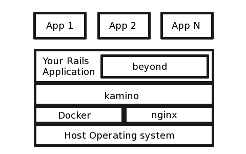

beyond
======

Beyond is a rails engine (mountable plugin), which uses [kamino](http://github.com/mzdravkov/kamino), Docker and nginx to let you easily build systems for automatic on-user-demand deploying of web applications (which are clones of one template web application) and managing their configurations and plugins.

Before proceed reading this, please make sure you have read kamino's readme.

A diagram showing the position of beyond in the system.

## Why beyond is a Rails Engine?

Beyond is a Rails engine, and not a full application, because you will most likely want to get beyond's functionality, but at least add your own routes, views, styles, etc. This is also the reason why beyond stays as much barebone as it can. Because beyond is an engine, you can simply mount it into your application and don't bother how it is working internally.

## What beyond brings to your application?

Beyond gives you:
- user authorization
- automatic on-user-demand deploying of web applications
- users can change their configuration
- users can add plugins to their web applications (and stop/start them)

That said, you should not use beyond on applications with their own authorization, except you really know what you are doing.

##Installation
Add this to your Gemfile

`gem 'beyond'`

Add this to your `config/routes.rb`:

`mount Beyond::Engine, at: '/'`

##Usage
If you want to access beyond routes, you can do it with beyond.route. For example `beyond.new_user_sesion_path` is the path to user sign in.

You can create scripts, which shall be run on some events.

For example application, please see [Videira](http://github.com/mzdravkov/videira).
